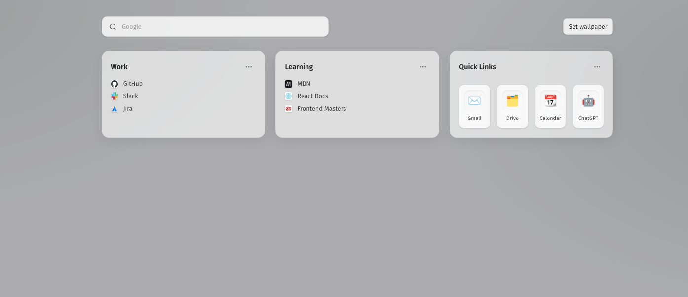

# Better Bookmarks - WiP

A modern, open-source bookmark landing page for your browser.  
**Better Bookmarks** helps you organize your favorite links into logical, customizable blocks—improving productivity and focus, without the need to pay for premium bookmark managers.

## Features



- Organize bookmarks into sections (work, learning, quick links, etc.)
- Visual, clean, and distraction-free interface
- Custom wallpaper/background support
- Fast, responsive, and privacy-friendly (no accounts, no cloud)
- Built with modern web technologies

## 🛠️ Tech Stack

- **React 19** – UI library
- **Vite** – Lightning-fast build tool
- **TypeScript** – Type safety
- **Tailwind CSS** – Utility-first styling
- **Framer Motion** – Animations
- **PostCSS** & **Autoprefixer** – CSS processing

## 🚀 Getting Started

### Prerequisites

- [Node.js](https://nodejs.org/) (v18+ recommended)
- [npm](https://www.npmjs.com/) (comes with Node.js)

### Installation

1. **Clone the repository:**
   ```sh
   git clone https://github.com/your-username/better-bookmarks.git
   cd better-bookmarks
   ```

2. **Install dependencies:**
   ```sh
   npm install
   ```

3. **Start the development server:**
   ```sh
   npm run dev
   ```
   Open [http://localhost:5173](http://localhost:5173) in your browser.

4. **Build for production:**
   ```sh
   npm run build
   ```

5. **Preview the production build:**
   ```sh
   npm run preview
   ```

## 📝 Motivation

Most bookmark managers are either too basic or locked behind paywalls.  
**Better Bookmarks** is designed to be a free, customizable, and visually appealing alternative—helping you organize your links in logical blocks for maximum productivity.
This code was completely vibe-coded using GPT 5.


Next steps:
[x] Improve sections handling
[x] Storage all sections contents in sessionStorage or something to reuse
[ ] Improve wallpaper storage
[ ] Improve UI
[ ] Create new sections button
[ ] Improve bookmark edit form
[ ] Fix de wallpaper